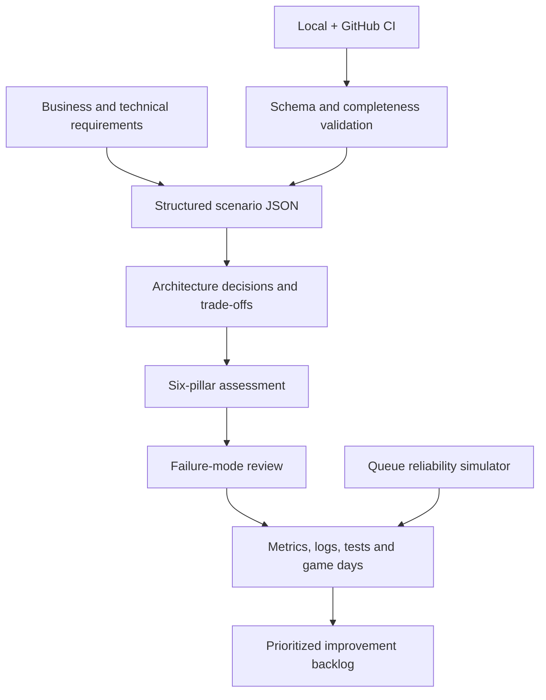

# AWS Well-Architected Production Labs

[](https://github.com/jeevanm84/aws-well-architected-production-labs/actions/workflows/ci.yml)
[](https://docs.aws.amazon.com/wellarchitected/latest/framework/welcome.html)
[](LICENSE)

Scenario-driven AWS architecture labs that turn business requirements into explicit decisions, failure analysis, operational evidence, disaster-recovery objectives, and cost controls. The repository is locally testable and does not deploy AWS resources.

> No AWS account is required. These labs assess architecture judgment before implementation. Use the dedicated Terraform and Packer repositories for reviewed infrastructure execution.

## Why this repository exists

Architecture diagrams alone do not prove production readiness. A useful design must connect:

```text
Business outcome → Measurable requirements → Architecture decision
→ Failure mode → Detection → Recovery → Cost → Verification → Revisit trigger
```

The labs use the six current AWS Well-Architected pillars: operational excellence, security, reliability, performance efficiency, cost optimization, and sustainability. See [Official References](docs/REFERENCES.md).

## Architecture review system



## Labs

| Lab | Architecture problem | Primary evidence |
|---:|---|---|
| 01 | Highly available public web platform | Multi-AZ failure domains, scaling, state and recovery |
| 02 | Event-driven order processing | Idempotency, retries, backpressure and dead-letter handling |
| 03 | Multi-account security foundation | Identity, guardrails, centralized detection and break-glass access |
| 04 | Disaster-recovery strategy | RTO/RPO, backup restoration, pilot light and regional failover |
| 05 | Cloud cost and capacity incident | Cost attribution, anomaly detection, demand matching and prevention |

Every lab includes requirements, a reference diagram, structured assessment data, failure scenarios, interview prompts, and a production-readiness checklist.

## Quick local verification

Prerequisites: Python 3 and Bash.

```bash
git clone https://github.com/jeevanm84/aws-well-architected-production-labs.git
cd aws-well-architected-production-labs
./scripts/check.sh
python3 scripts/assess.py scenarios/01-ha-web.json
python3 simulators/queue_delivery.py
```

No AWS CLI, credentials, account, or network connection is used.

## Repository map

```text
aws-well-architected-production-labs/
├── scenarios/                      # Machine-checkable architecture assessments
├── labs/                           # Guided requirements and review exercises
├── simulators/                     # Local reliability behavior demonstrations
├── tests/                          # Assessment and simulator tests
├── docs/
│   ├── END_TO_END_GUIDE.md
│   ├── REVIEW_METHOD.md
│   ├── TROUBLESHOOTING.md
│   ├── INTERVIEW_QUESTIONS.md
│   └── REFERENCES.md
├── scripts/                        # Offline validation and reporting
└── .github/                        # CI, ownership and community workflow
```

## Review dimensions

| Pillar | Questions emphasized |
|---|---|
| Operational excellence | Ownership, runbooks, observability, change safety, game days and continuous improvement |
| Security | Identity, detection, infrastructure/data protection, application security and incident response |
| Reliability | Quotas, failure isolation, automated recovery, change management and tested recovery |
| Performance efficiency | Service selection, scaling characteristics, measurement and evolution |
| Cost optimization | Accountability, usage visibility, demand matching and lifecycle optimization |
| Sustainability | Demand alignment, efficient software/data patterns, managed services and reduced idle work |

Security and operational excellence are treated as foundational constraints, not optional trade-offs.

## Relationship to implementation repositories

```text
Git foundations
  → AWS architecture decisions (this repository)
  → Terraform implementation
  → Packer immutable images
  → Kubernetes platform engineering
  → MJCart capstone
```

- [Terraform AWS HA Web Platform](https://github.com/jeevanm84/terraform-aws-ha-web-platform)
- [Packer AWS Golden Image Pipeline](https://github.com/jeevanm84/packer-aws-golden-image-pipeline)
- [Kubernetes Zero to Production](https://github.com/jeevanm84/kubernetes-zero-to-production)
- [MJCart E-commerce Microservices](https://github.com/jeevanm84/mjcart-ecommerce-microservices)

## Boundaries

The reference architectures are starting points, not universal production prescriptions. Actual designs require organization-specific compliance, threat, traffic, data, recovery, region, service-quota, operational-maturity, and pricing inputs.

Maintained by [@jeevanm84](https://github.com/jeevanm84) · [MIT License](LICENSE)
