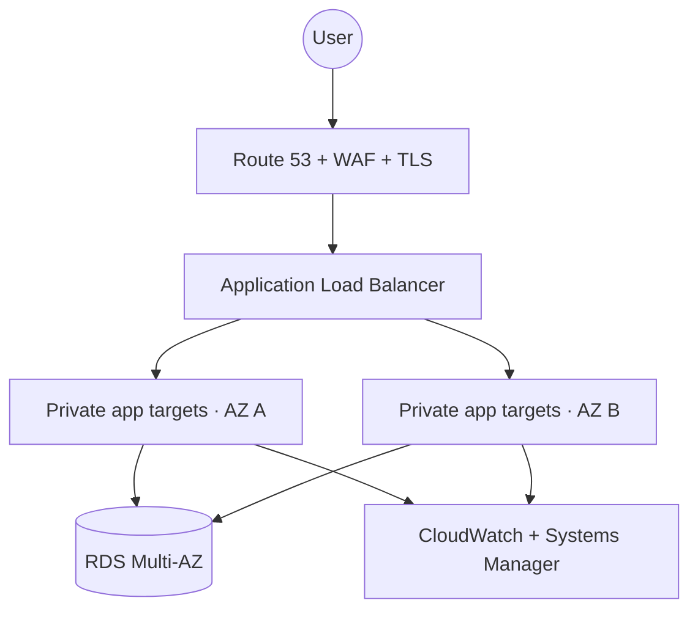

# Lab 01 — highly available web platform

## Problem

Design a customer-facing application that tolerates instance and single-AZ failure while keeping compute and data private.

## Exercise

1. Review `scenarios/01-ha-web.json`.
2. Run `python3 scripts/assess.py scenarios/01-ha-web.json`.
3. Identify hidden single dependencies: NAT, secrets, identity, deployment, capacity, DNS and third parties.
4. Define normal and one-AZ capacity.
5. Write a game day with customer-journey verification and rollback criteria.

## Scenario questions

- Is a single NAT compatible with the availability target?
- Does Multi-AZ RDS meet the required RPO during every failure class?
- What happens if healthy hosts remain but the business transaction fails?
- Which service quotas need failover headroom?

## Production evidence

Require load results, target replacement timing, AZ exercise, database restore/failover timing, synthetic transactions, change audit and unit cost.
