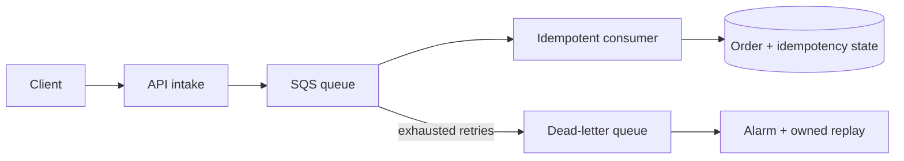

# Lab 02 — event-driven order processing

## Problem

Decouple order intake from processing while preserving durable work and preventing duplicate effects.



## Executable behavior

```bash
python3 simulators/queue_delivery.py
python3 tests/test_queue_delivery.py
python3 scripts/assess.py scenarios/02-event-orders.json
```

The simulation demonstrates transient retries, duplicate suppression and poison-message isolation. It does not reproduce SQS visibility timing, Lambda concurrency, partial batch response or regional behavior.

## Scenario questions

- Where is the idempotency key generated and how long is it retained?
- What controls consumer concurrency against a throttled dependency?
- Who owns the DLQ and how is replay authorized?
- How are business ordering requirements partitioned?
- What is the maximum acceptable age of the oldest message?
