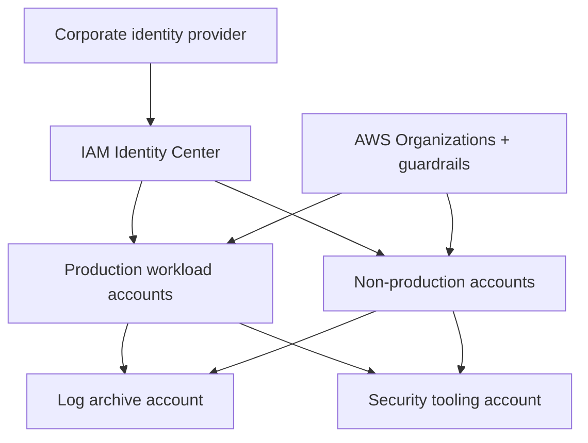

# Lab 03 — multi-account security foundation

## Problem

Design account, identity, logging and security-response boundaries that reduce blast radius and administrative conflict.

## Exercise

Run `python3 scripts/assess.py scenarios/03-multi-account-security.json`, then design:

- Organizational units and account lifecycle
- Federated permission sets and session duration
- Preventive guardrails and exceptions
- Organization-level logs and integrity protection
- Finding aggregation and response authority
- Monitored break-glass access
- Account ownership and cost allocation

## Failure scenarios

Tabletop federated identity outage, central-log delivery failure, compromised workload administrator and guardrail deployment error. For each, preserve evidence and distinguish containment from permanent correction.
