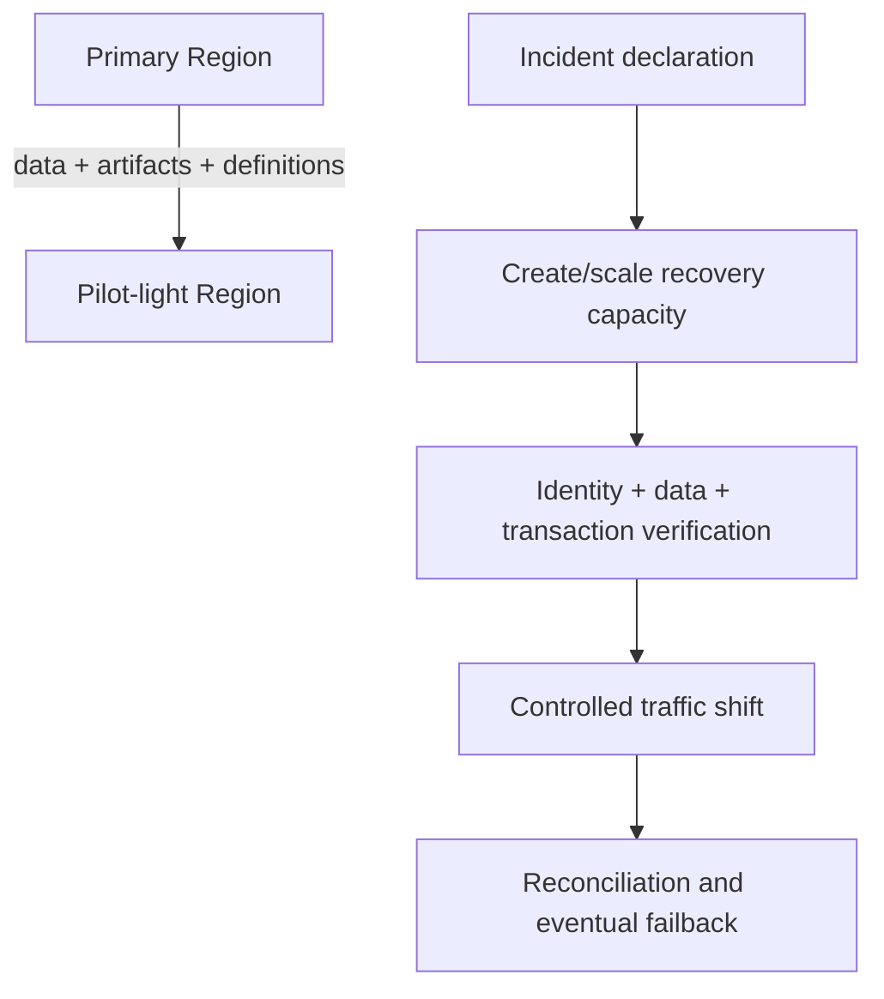

# Lab 04 — disaster recovery

## Problem

Select and prove a regional recovery strategy for a workload with a 60-minute RTO and 15-minute RPO.

## Exercise

1. Compare backup/restore, pilot light, warm standby and active/active.
2. Run `python3 scripts/assess.py scenarios/04-disaster-recovery.json`.
3. Build a minute-by-minute recovery timeline.
4. Identify Region-bound dependencies, keys, secrets, artifacts, quotas and third parties.
5. Define data reconciliation and failback.

## Evidence

The RTO begins when disruption affects the business—not when an engineer starts the restore command. Measure detection, declaration, access, restore, scale, verification, DNS/client behavior and data reconciliation.
