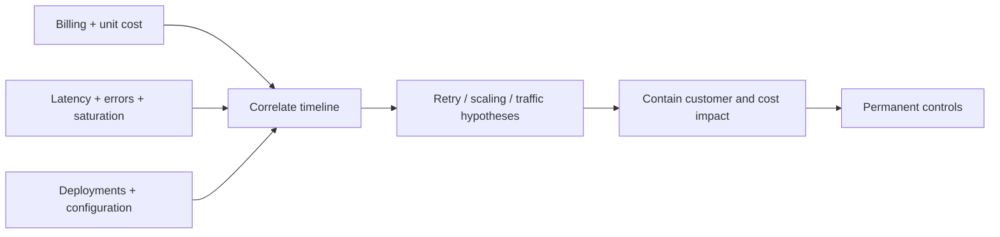

# Lab 05 — cost and capacity incident

## Incident

Daily cost triples while latency and error rate rise. Leadership asks for immediate cost reduction without a reliability assessment.

## Investigation

Run `python3 scripts/assess.py scenarios/05-cost-capacity-incident.json`, then determine:

- What changed at the anomaly start?
- Did traffic, retries, payload, log volume, data transfer or capacity change?
- What is cost per successful transaction?
- Which capacity is required for normal and failure conditions?
- Which mitigation is reversible and SLO-safe?

## Prevention

Implement accountable allocation, anomaly routing, retry budgets, measured scaling, lifecycle policies, unit-cost dashboards and periodic failover-capacity tests.
